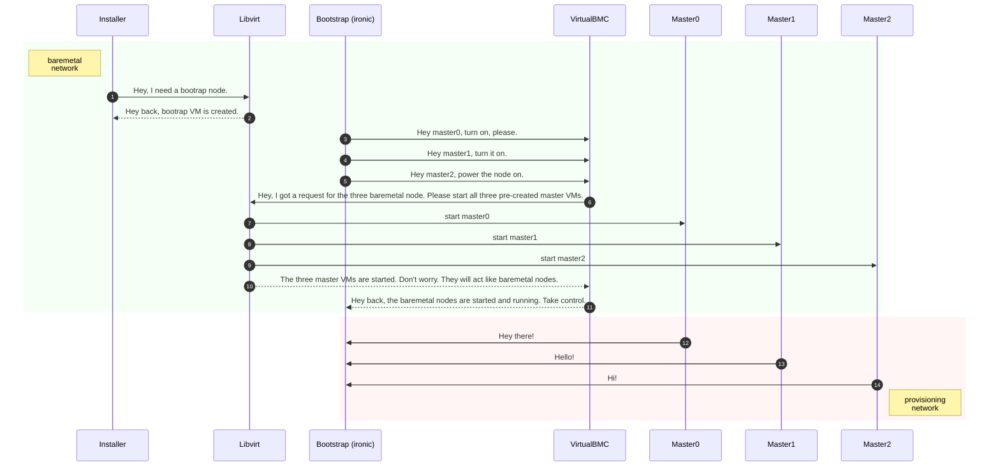

# OpenShift IPI Baremetal Lab (oibl)


A lab environment that can be used for studying the OpenShift bare metal IPI deployment and its internal parts. It also fulfils the need for creating an OpenShift cluster with minimal intervention and time.

## Architecture


## Deployment sequence


## Prerequisites
|Machine|Operating System|CPU|RAM|DISK|
|:-:|:-:|:-:|:-:|:-:|
|Provisioner node|[Fedora CoreOS](https://getfedora.org/en/coreos/download/)|20|80 GB|240 GB|

> Enable nested virtualization if the host is a VM. For example, in Red Hat Virtualization, enable the `Pass-Through Host CPU` CPU option in the Virtual Machine settings (Under the Host section).

> Use the Testing release stream of Fedora CoreOS.
> ```bash
> export ISO=$(curl -s https://builds.coreos.fedoraproject.org/streams/testing.json | \
>              jq -r .architectures.x86_64.artifacts.metal.formats.iso.disk.location)
> curl -# -O ${ISO}

## Preparation
### Install and configure provisioner node
```bash
$ echo 1 | sudo tee /proc/sys/net/ipv6/conf/all/disable_ipv6
$ sudo coreos-installer install /dev/sda --ignition-url=https://bit.ly/oibl-ignition-develop
$ sudo systemctl reboot
$ ssh kni@<IP> (Enter `Kni@123` as password)
$ sudo rpm-ostree rebase --experimental \
       ostree-unverified-registry:quay.io/oibl/oibl:develop
$ sudo rpm-ostree kargs --append=selinux=0 --reboot
```

## Usage
### Check if the host is ready
Wait for the machine to become ready itself with the hosted services such as DHCP, VBMC and Webserver. If you list the containers using Podman, you could see the below list.
```bash
$ sudo podman ps --format "{{.Names}}"
webserver
vbmc
dhcp
```
Once the system is ready, you will also get notified with a broadcase message:
```bash
The containerized services (webserver vbmc dhcp) are ready.
You can start the OpenShift baremetal IPI installation now.
```

### Create cluster
```bash
$ oibl help
$ oibl ssh-pullsecret OCM_TOKEN=<token from https://cloud.redhat.com/openshift/token>
$ oibl install-config RELEASE=stable-4.11
$ oibl cluster LOGLEVEL=info
```

## Customization
### Generate an ignition (Optional)
```bash
$ git clone --recurse-submodules https://github.com/kevydotvinu/ocp-ipi-baremetal-lab
$ cd ocp-ipi-baremetal-lab
$ make generate-ignition
$ ls ignition/00-core.ign
```

### Build and push an ostree container image (Optional)
```bash
$ git clone --recurse-submodules https://github.com/kevydotvinu/ocp-ipi-baremetal-lab
$ cd ocp-ipi-baremetal-lab
$ podman login --authfile auth.json <registry>
$ make build-push-ostree OSTREE_IMAGE=<registry>/<repository>/<image>
```

## Tips
### Get SSH access to FCOS LiveCD session
Serve the SSH public key from your workstation using python module
```bash
$ sudo iptables -I INPUT 1 -p tcp --dport 9900 -j ACCEPT
$ python -m SimpleHTTPServer 9900 || python3 -m http.server 9900
```
Collect the SSH key from FCOS LiveCD
```bash
$ curl --create-dirs --output ~/.ssh/authorized_keys http://<workstation-ip>:9900/.ssh/id_rsa.pub
```
Access FCOS LiveCD session using SSH from your workstation
```bash
$ ssh core@<fcos-ip>
```

## Known issues
### The containerized services are not ready
**Error**
```bash
Makefile:14: *** The containerized services (dhcp vbmc webserver) are not ready. \
Check with 'sudo podman ps' and wait for a while to retry.  Stop.
```
**Workaround**
```bash
sudo systemctl status dhcp vbmc webserver
sudo systemctl restart dhcp vbmc webserver
```

### The VMs are not ready
**Error**
```bash
Makefile:19: *** The VMs are not ready. Please check their status with \
'sudo systemctl restart master0 master1 master2 worker0 worker1'.  Stop.
```
**Workaround**
```bash
sudo systemctl status master0 master1 master2 worker0 worker1
sudo systemctl restart master0 master1 master2 worker0 worker1
```
